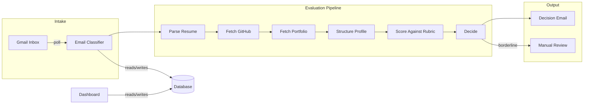

# AI Candidate Evaluator

An autonomous email agent that screens job applicants end-to-end — from inbox to personalized decision email — with zero human intervention for clear-cut cases and smart escalation for borderline ones.

## The Problem

Screening inbound applications takes 15–30 minutes per candidate: open the resume, cross-reference GitHub, check portfolio quality, draft a response. For small teams without a recruiting function, this means burning engineering time or letting strong candidates slip through the cracks. Worse, candidates wait days for a reply — if they get one at all.

## The Solution

You define a scoring rubric once — what matters, how much each dimension weighs — and the agent handles everything else. It parses resumes, fetches GitHub and portfolio signals, evaluates against your rubric, and sends personalized pass/fail emails. Candidates hear back in minutes instead of days, scored consistently against the same criteria every time.

Clear passes and clear fails are handled automatically. Borderline candidates land in your dashboard for a manual call.

## How It Works



The system monitors a Gmail inbox on a configurable interval. When a new email arrives, it classifies the message (application, question, spam, etc.) and routes it accordingly. Valid applications enter a step-by-step pipeline: extract text from the resume PDF, pull GitHub activity and language data, scrape the portfolio for live demos and shipped work, then normalize everything into a clean structured profile.

That structured profile gets scored by Claude Opus against the rubric you defined. The AI produces a 0–100 score per dimension with cited evidence, a weighted overall score, and a one-sentence human-readable verdict. Based on your thresholds, the candidate is auto-passed, auto-failed, or flagged for your review.

Each pipeline step is an independent job. If GitHub is down or a portfolio times out, that step retries on its own with exponential backoff — the candidate's evaluation picks up right where it left off instead of restarting from scratch.

## What You Can Do (Dashboard)

**Candidate Pipeline** — See every candidate at a glance: name, email, score, status. Filter by status (manual review, auto-pass, auto-fail, incomplete, errors). Sort by date or score. Top-line metrics show total candidates, how many need your attention, and average score.

**Candidate Detail** — Drill into any candidate to see the full picture: overall score, per-dimension breakdown with AI reasoning, work experience, shipped products, GitHub and portfolio signals, the complete email thread, and a step-by-step processing timeline. For borderline candidates, one click to approve or reject — the decision email goes out immediately.

**Intelligence Core (Settings)** — Author your scoring rubric: add dimensions, write descriptions (fed directly to the AI), set weights. Configure auto-pass and auto-fail thresholds. Adjust polling frequency, company name, and how long to wait before reminding or expiring incomplete applications.

**System Logs** — Full processing timeline across all candidates. Filter by pipeline step, severity level, or candidate email. Useful for understanding why a candidate scored the way they did or diagnosing a processing issue.

**Poll Now** — Trigger an immediate inbox check from the sidebar instead of waiting for the next polling interval.

## What Candidates Experience

Every candidate gets a response — no one gets ghosted.

- **Complete application** — Acknowledgment within minutes, then a decision email. Passes get a warm congratulations with next steps. Fails get a respectful note with a brief reason. No scores, rubric terms, or AI jargon are ever exposed.
- **Missing items** — A friendly email listing exactly what's missing (resume, GitHub, portfolio) so they can follow up.
- **Wrong format** — If they send a non-PDF resume, they're asked to resend as PDF.
- **Duplicate submission** — They're told the old one is retired and the latest version is being evaluated.
- **Broken links** — If GitHub is private or portfolio is down, they get a specific heads-up to fix and resend.
- **Incomplete timeout** — A reminder after a configurable delay, then a graceful close-out if they never follow up.
- **Edge cases** — Even spam, gibberish, and empty emails get a response pointing them in the right direction.

## Architecture

A single Python backend (FastAPI) handles both the API and an embedded async worker — no separate task runner or message broker needed. PostgreSQL is the only infrastructure dependency: it stores candidates, evaluations, and settings, and doubles as the job queue using row-level locking for safe concurrency.

The AI work is split into two stages to optimize cost and quality. A smaller, faster model (Claude Sonnet) handles classification and data extraction — cheap work that runs on every email. The more capable model (Claude Opus) only runs once per candidate, scoring a clean structured profile against the rubric. System prompts use caching to cut repeat costs.

The dashboard is a Next.js app that shares the same database. Authentication uses a shared JWT secret between frontend and backend — simple to set up, easy to swap for a real identity provider later.

## Tech Stack & Why

- **Python + FastAPI** — Fast to build, strong data validation with Pydantic, and well-suited for both API serving and background processing in one process.
- **PostgreSQL** — One managed database handles everything: application data, job queue, and settings. No Redis, no separate queue service. Retries survive restarts because jobs live in the database, not in memory.
- **Claude Sonnet + Opus** — Two-model pipeline keeps costs low. Sonnet normalizes messy inputs cheaply; Opus only scores clean, structured data against the rubric. Prompt caching makes repeated evaluations cheaper after the first couple of candidates.
- **PyMuPDF** — The fastest reliable way to extract text from resume PDFs in Python.
- **Playwright** — Some portfolios are single-page apps that don't render without JavaScript. Playwright handles those when a simple HTTP fetch fails.
- **Next.js 15 + Auth.js** — Server components fetch data and render in one round-trip. Auth.js gives us email/password login now with a clear upgrade path to SSO later.
- **Tailwind CSS** — Utility-first styling that keeps the dashboard responsive without custom CSS breakpoints.
- **Vitest + Playwright** — Fast unit tests plus cross-browser end-to-end tests with visual regression to catch UI regressions.

## Trade-offs

- **Resume PDFs only.** Scanned/image-based PDFs and other file types aren't supported. Non-PDF attachments get an email asking the candidate to resend. This keeps the parsing pipeline simple and reliable.
- **Email/password auth, not SSO.** This is an internal tool with a small user base. The auth layer is designed to be swapped for a real identity provider when needed — a minimal change, not a rewrite.
- **Single worker process.** The job queue supports parallel workers, but one is enough for this volume. Scaling up means adding processes, not changing architecture.
- **No retroactive re-scoring.** When you update the rubric, only new candidates are evaluated against it. Old evaluations keep their original scores. This is intentional — changing the rules after the fact would undermine the audit trail.
- **One rubric for all roles.** The database schema supports per-role rubrics, but the dashboard UI doesn't yet. For now, one rubric covers everything.
- **Polling, not real-time.** The inbox is polled on an interval rather than using push notifications. This is simpler to operate and debug, with a configurable interval as low as one minute.

## What I'd Improve with More Time

- **Real-time email intake** — Switch from polling to Gmail push notifications so candidates are processed the moment their email lands.
- **Per-role rubrics** — The schema already supports it. Building the dashboard UI to let you create and assign rubrics per open role is the next high-value feature.
- **One-click reprocessing** — When a candidate hits a transient error (GitHub was down, portfolio timed out), you should be able to retry from the dashboard instead of waiting for the system to retry on its own.
- **Evaluation quality metrics** — A labeled test set of "known good" and "known bad" candidates to continuously measure whether the classifier and scorer are drifting.
- **Live processing view** — Stream pipeline events to the dashboard so you can watch a candidate being evaluated in real time.
- **SSO** — Replace email/password with Google Workspace or SAML once the user base grows beyond a handful of people.

## Getting Started

**Backend:**
```bash
cd backend
cp .env.example .env              # fill in Anthropic, Gmail OAuth, GitHub token
python -m venv .venv && source .venv/bin/activate
pip install -e .[dev]
docker run -d --name pg -e POSTGRES_PASSWORD=postgres -p 5432:5432 postgres:16
alembic upgrade head
uvicorn app.main:app --reload     # starts API + embedded worker
```

**Dashboard:**
```bash
cd web
cp .env.example .env.local        # AUTH_SECRET must match backend NEXTAUTH_JWT_SECRET
npm install && npm run dev        # http://localhost:3100
```

Sign in: `admin@curator.local` / `curator`

## Tests

| Tier | Runner | Tests | Wall time |
|------|--------|-------|-----------|
| Backend (hermetic) | pytest | 56 | ~0.1s |
| Backend (live Gmail) | pytest -m live | 4 | ~30s |
| Frontend unit | Vitest | 47 | ~1.4s |
| E2E (3 browsers + visual) | Playwright | 99 | ~96s |

Full instructions: **[TESTING.md](TESTING.md)**

## Further Reading

- [Backend deep dive](backend/BACKEND_STATUS.md)
- [Frontend deep dive](web/FRONTEND.md)
- [Product requirements](PRD_AI_Candidate_Evaluator_V1.md)
- [Original brief](plum_builders_residency_brief.md)
