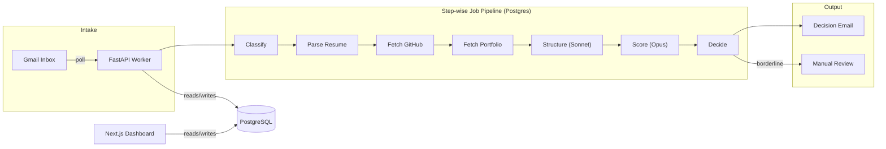

# AI Candidate Evaluator

An autonomous email agent that screens job applicants end-to-end — from inbox to personalized decision email — with zero human intervention for clear-cut cases and smart escalation for borderline ones.

## The Problem

Screening inbound applications takes 15–30 minutes per candidate: open the resume, cross-reference GitHub, check portfolio quality, draft a response. For small teams without a recruiting function, this means burning engineering time or letting strong candidates slip through the cracks.

## The Solution

A hiring manager defines a scoring rubric once in a dashboard (what matters, how much each dimension weighs). The agent handles everything else: parsing resumes, fetching GitHub and portfolio signals, evaluating against the rubric, and sending personalized pass/fail emails. Candidates get a response in minutes instead of days, scored consistently against the same criteria every time.

## Architecture



The backend is a single FastAPI image on Railway with an embedded asyncio worker. Each candidate flows through ~10 discrete job types stored in a Postgres `jobs` table — claimed with `SELECT ... FOR UPDATE SKIP LOCKED` so transient failures (GitHub 5xx, portfolio timeouts) retry independently with exponential backoff without losing partial progress. The LLM work is split across two models: Sonnet does cheap, fast extraction and triage; Opus does the expensive rubric scoring against clean structured data. A Next.js dashboard shares the same Postgres and exposes candidate review, rubric editing, manual overrides, and a poll-now button.

## Tech Stack & Rationale

- **Python + FastAPI** — fast to ship, strong Pydantic validation, good fit for background jobs
- **PostgreSQL (Railway)** — single managed dependency; doubles as job queue (no Redis needed)
- **Postgres job queue over Celery/RQ** — retries are durable across restarts without an extra service; `SKIP LOCKED` gives safe concurrency
- **Claude Sonnet → Opus pipeline** — cheap model normalizes messy inputs; capable model only scores clean data against the rubric
- **Prompt caching** — system prompts marked `cache_control: ephemeral`; breaks even after ~2 candidates
- **PyMuPDF** — fastest reliable PDF text extraction in Python
- **Playwright + Chromium** — SPA-aware portfolio scraping when static HTTP fails
- **Next.js 15 + Auth.js v5** — server components do backend fetch + render in one round-trip; HS256 JWT shared with FastAPI keeps auth simple
- **Tailwind CSS** — utility-first styling, responsive by default
- **Vitest + Playwright** — fast unit tests plus cross-browser E2E with visual regression

## What I'd Improve with More Time

- **Gmail Pub/Sub** instead of polling — true real-time intake
- **Per-role rubrics** — schema is designed for it (add a `Role` table, FK from `Candidate`); dashboard UI isn't
- **One-click reprocessing** of `processing_error` candidates from the dashboard
- **Labeled evals** on the classifier and scorer with a golden set (PRD §10 metrics)
- **SSE log streaming** so you can watch a candidate get evaluated live in the dashboard
- **Mobile visual baselines** — currently desktop 1280×800 only
- **Real IdP** (Google Workspace SAML) once there are more than a few users

## Trade-offs

- **Resume PDFs only.** Scanned/OCR PDFs are out of scope. Non-PDF attachments trigger an email asking the candidate to re-send.
- **Email/password auth, not SSO.** Internal platform with hardcoded test users — the HS256 JWT contract makes swapping to a real provider a minimal change.
- **One worker process.** `SKIP LOCKED` supports many; one is operationally sufficient for this scale.
- **No retroactive re-scoring on rubric change.** Old evaluations keep their scores. Only new candidates get the updated rubric.
- **Global rubric, not per-role.** Schema is ready; UI isn't. One rubric covers the residency scope.
- **Desktop-only visual regression baselines.** Mobile responsiveness is enforced by Tailwind, not by E2E tests.

## Quick Start

**Backend:**
```bash
cd backend
cp .env.example .env              # fill in Anthropic, Gmail OAuth, GitHub token
python -m venv .venv && source .venv/bin/activate
pip install -e .[dev]
docker run -d --name pg -e POSTGRES_PASSWORD=postgres -p 5432:5432 postgres:16
alembic upgrade head
uvicorn app.main:app --reload     # starts API + embedded worker
```

**Dashboard:**
```bash
cd web
cp .env.example .env.local        # AUTH_SECRET must match backend NEXTAUTH_JWT_SECRET
npm install && npm run dev        # http://localhost:3100
```

Sign in: `admin@curator.local` / `curator`

## Tests

| Tier | Runner | Tests | Wall time |
|------|--------|-------|-----------|
| Backend (hermetic) | pytest | 56 | ~0.1s |
| Backend (live Gmail) | pytest -m live | 4 | ~30s |
| Frontend unit | Vitest | 47 | ~1.4s |
| E2E (3 browsers + visual) | Playwright | 99 | ~96s |

Full instructions: **[TESTING.md](TESTING.md)**

## Further Reading

- [Backend deep dive](backend/BACKEND_STATUS.md)
- [Frontend deep dive](web/FRONTEND.md)
- [Product requirements](PRD_AI_Candidate_Evaluator_V1.md)
- [Original brief](plum_builders_residency_brief.md)
